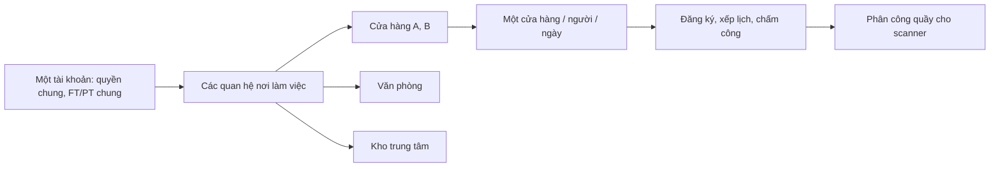

# Thiết kế tài khoản có nhiều nơi làm việc

Ngày khảo sát: 14/09/2026. Trạng thái: đề xuất kiến trúc và kế hoạch triển khai; chưa thay đổi mã nghiệp vụ hoặc dữ liệu vận hành.

## 1. Yêu cầu đã xác nhận và quyết định đang chờ

**Đã xác nhận:**

- Một tài khoản có thể đồng thời thuộc nhiều cửa hàng, văn phòng và kho trung tâm; vai trò/quyền dùng chung, không khác nhau theo từng nơi.
- Ca/công chỉ áp dụng cho cửa hàng. Không mở rộng đăng ký, xếp lịch hoặc chấm công sang văn phòng/kho trong đợt này.
- Mỗi nhân viên chỉ đăng ký một cửa hàng trong một ngày; tuyệt đối không trùng giờ. Thiết kế áp dụng cùng ràng buộc cho lịch chính thức và force-assign để không đi vòng qua đăng ký.
- Mỗi tài khoản có duy nhất một loại FT hoặc PT; định mức tính chung trên tài khoản.
- Quyền thêm/ngừng nơi làm việc phải được bổ sung vào chức năng phân quyền hiện có; không hardcode chỉ admin hoặc một chức danh cụ thể.

Mục tiêu là giữ một danh tính đăng nhập và một hồ sơ nhân sự, thêm quan hệ với nhiều nơi làm việc, đồng thời đảm bảo đăng ký ca, lịch làm việc, công và giao dịch kho được ghi nhận đúng nơi phát sinh.

| Vấn đề cần chốt | Đề xuất để thảo luận | Ảnh hưởng |
| --- | --- | --- |
| Scanner chọn vị trí theo phân công hay tự chọn nơi được cấp? | Dùng phân công hợp lệ làm nguồn chính; quyền quét tự do cần xác định rõ phạm vi | Giữ hay điều chỉnh quyền `action.product_scanner.scan_any_counter` hiện tại |
| Ngày nghiệp vụ của ca qua đêm | Ngày bắt đầu ca tại Asia/Ho_Chi_Minh; vẫn chặn giao nhau thời gian với ca ngày kế tiếp | Cho phép ca A tối thứ Hai, ca B chiều thứ Ba nếu không trùng; nếu quy tắc là mọi ngày lịch có mặt thì khóa cả hai ngày |
| Một ngày tại một cửa hàng được bao nhiêu ca? | Giữ maxShiftsPerDay tại cửa hàng, bổ sung trần chung nếu cần; các ca không trùng giờ | Không suy “một nơi/ngày” thành “một ca/ngày” |
| Giá trị định mức chung lấy từ đâu khi cấu hình cũ khác nhau? | Tạo chính sách nhân sự chung theo FT/PT; trường hợp khác nhau cần bảng đối chiếu để chốt | Không tự lấy quota cửa hàng đang chọn hoặc lấy trung bình |
| Được chấm công khi chưa được xếp lịch không? | Chỉ theo lịch; nếu cho ngoài lịch thì giữ cửa hàng/ngày bằng transaction và đánh dấu đối soát | Không tạo đường vòng để có công hợp lệ tại hai cửa hàng/ngày |

Các dòng đề xuất chưa phải quy tắc đã được duyệt. Chúng không ngăn việc xây lớp quan hệ và định danh chung, nhưng phải được chốt trước khi mở các luồng phụ thuộc.

## 2. Kết quả khảo sát mã nguồn

Dự án dùng Next.js App Router, React, Firebase Auth và Firestore; có cả đọc Firestore trực tiếp từ trình duyệt, API dùng Bearer token và Server Actions dùng session cookie. Desktop/mobile có nhiều trang triển khai riêng; mobile scanner dùng lại trang desktop.

Đã tìm thấy 87 tệp trong `app`, `actions`, `components`, `contexts`, `hooks`, `lib`, `types` có tham chiếu các trường nơi làm việc, ngữ cảnh cửa hàng hoặc helper khóa lịch. Đây là phạm vi rà soát, không phải khẳng định cả 87 tệp đều cần thay đổi.

| Thành phần | Hiện trạng kiểm chứng từ mã | Hệ quả khi hỗ trợ nhiều nơi |
| --- | --- | --- |
| `types/index.ts`: `UserDoc` | Một `workplaceType`, một `storeId`/`officeId`/`warehouseId`; role, customRoleId, canManageHR nằm ở tài khoản | Cần quan hệ nhiều nơi, giữ quyền toàn tài khoản theo yêu cầu |
| `contexts/AuthContext.tsx` | Nhân viên cửa hàng dùng cố định `user.storeId`; văn phòng lấy `office.managedStoreIds`; bộ chọn lưu `office_selected_store_id` | Ngữ cảnh UI và phạm vi truy cập đang trộn với nơi trực tiếp làm việc |
| `app/api/auth/create-user`, `update-user` | Tạo một nơi; cập nhật loại nơi sẽ xóa cả ba ID rồi đặt lại một ID | Thêm nơi mới có thể vô tình thay nơi cũ nếu giữ API hiện tại |
| `app/api/auth/toggle-active` | Quản lý cửa hàng có thể đổi `users.isActive` cho nhân viên thuộc cửa hàng mình | Với nhiều nơi, ngừng ở A có thể khóa luôn việc ở B |
| `lib/utils.ts`, đăng ký desktop/mobile, `app/api/register/force-assign` | ID đăng ký là `{uid}_{weekStartDate}` | Cùng người/cùng tuần ở nơi B đụng bản ghi của nơi A |
| `app/api/register/route.ts` | Lấy nơi từ caller.storeId; POST dùng body.id để chọn document; quota lấy roster từ `users.storeId` | Cần ID do server tạo, membership theo ngày, kiểm tra payload và quota xuyên nơi |
| `app/api/schedules/route.ts`, `bulk/route.ts` | ID là `{date}_{shiftId}_{counterId}`; kiểm tra vai trò nhưng chưa có kiểm tra đầy đủ scope nơi và từng nhân viên | Có thể đụng khóa nếu hai nơi trùng mã ca/quầy; cần sửa phân quyền trước rollout |
| Builder/overview/register/history lịch quản lý | Query đăng ký/lịch theo storeId, nhiều roster theo `users.storeId`; draft builder đã có storeId | Tận dụng bộ lọc hiện có, thay nguồn roster và thêm kiểm tra xung đột |
| Lịch cá nhân desktop | Query schedules theo employeeIds nên đã có thể trả nhiều nơi; cấu hình/KPI vẫn lấy một cửa hàng, đếm ca theo ngày+tên ca | Không được dùng cấu hình của A để hiển thị lịch B; cần khóa thống kê có nơi |
| `lib/attendance/software-service.ts`, `state.ts` | Chấm công suy từ user.storeId; trạng thái theo store+uid+ngày, một vào/một ra | Chuyển nơi và nhiều phiên trong ngày cần mô hình rõ ràng |
| `lib/attendance/manager-service.ts` | Tạo roster từ users.storeId và lọc nhân viên đang hoạt động trước khi ghép sự kiện | Nhân viên đã rời nơi/nghỉ có thể mất khỏi báo cáo lịch sử nếu vẫn theo roster hiện tại |
| Chấm công máy | Mapping và raw log đã có deviceId/storeId; mapping dùng deviceId+zk_user_id | Giữ cơ chế theo thiết bị, cho nhiều mapping trỏ cùng UID, kiểm tra nơi và hiệu lực |
| `lib/scanner-access.ts` | Placement đã có store/quầy/ca/ngày/WMS, nhưng lịch bị lọc theo user.storeId | Sửa điều kiện quan hệ để lấy phân công của nhiều nơi |
| Scanner quyền đặc biệt | Admin hoặc scan_any_counter lấy mọi kho/vị trí từ ERP; nhánh này dùng ERP warehouse ID làm storeId | Cần tách ID nội bộ và ID ERP; phạm vi quyền này phải chốt, không âm thầm thay nghĩa |
| Scanner thông thường | Lấy lịch hôm nay/hôm qua; quầy chưa mapping có thể mở các vị trí ERP của kho liên kết | Không coi đây là kiểm tra giờ ca chính xác; phải giữ hoặc thay fallback có chủ đích |
| `actions/scanner.ts`, scanner UI | Server đã xác minh placement cho nhiều thao tác; UI đã có bộ chọn placement, queue và kiểm đếm | Tái sử dụng, kiểm tra lại quyền khi ghi và chống phản hồi cũ khi đổi vị trí |
| `app/api/inventory/my-assignment`, `hooks/useCounterAssignment.ts` | API trả danh sách nhưng đồng thời trải phần tử đầu; hook chỉ dùng phần tử đầu | Không được tự chọn quầy đầu khi có nhiều phân công |
| KPI, tồn kho, referral, thông báo, AI context, hồ sơ/export | Nhiều đường dẫn vẫn dựa vào một storeId | Cần kiểm tra hồi quy cùng đợt, tránh các màn hình hiển thị sai nơi hoặc thống kê lặp |

Những điểm trên là kết luận từ mã local. Chưa truy cập dữ liệu production, chưa xác nhận Firestore Rules/indexes đang triển khai hoặc hợp đồng ERP thực tế. Không tìm thấy `firestore.rules`, `firestore.indexes.json`, `firebase.json` trong cây tệp đã khảo sát; điều đó không đồng nghĩa production không có Rules.

Trong lúc khảo sát, workspace có thay đổi nhân sự đồng thời: `lib/hr-access.ts` bổ sung `canManageHr()` đọc `action.hr.manage`/`manage_hr` cùng cơ chế legacy, được dùng bởi create/update/toggle-active và các màn hình HR. Đã đối chiếu bản thay đổi này: nó cải thiện cách nhận quyền HR nhưng vẫn dùng storeId đơn để giới hạn nơi. Khi triển khai cần tích hợp helper hiện hữu vào lớp quyền chung, bổ sung action membership riêng và scope đa nơi; không tạo một bộ kiểm tra HR song song hoặc tự cho `action.hr.manage` bao gồm quyền gán/ngừng nơi mới. Những thay đổi mã HR này không thuộc tài liệu khảo sát này.

## 3. Mô hình đề xuất

### 3.1. Tách danh tính, nơi làm việc và phạm vi quản lý

Giữ `users/{uid}` làm danh tính và hồ sơ chung: role, customRoleId, canManageHR, isActive, thông tin cá nhân, một loại FT/PT và lịch sử hợp đồng chung. Không nhân bản loại hợp đồng theo membership.

Thêm `workplace_memberships` làm nguồn chính cho quan hệ trực tiếp giữa tài khoản và nơi làm việc. Không chỉ thêm `storeIds[]`: một mảng không biểu diễn tốt trạng thái riêng, hiệu lực điều chuyển và lịch sử.



```ts
type WorkplaceType = 'STORE' | 'OFFICE' | 'CENTRAL';

type WorkplaceRef = {
  type: WorkplaceType;
  id: string;              // ID trong stores / offices / warehouses
  key: string;             // encode([type, id]), ví dụ hiển thị STORE:store-a
};

type WorkplaceMembership = {
  id: string;              // hash([uid, workplaceKey, effectiveFrom])
  userId: string;
  workplace: WorkplaceRef;
  status: 'ACTIVE' | 'SUSPENDED' | 'ENDED';
  effectiveFrom: string;   // ISO timestamp, đầu khoảng bao gồm
  effectiveTo: string | null; // cuối khoảng không bao gồm
  version: number;
  createdAt: string;
  createdBy: string;
  updatedAt: string;
  updatedBy: string;
};

// Bổ sung nhỏ vào UserDoc, không thay bộ quyền hiện tại:
// primaryWorkplaceKey?: string
// workplaceSchemaVersion?: number
```

Không đặt role/customRoleId/permissions trên membership. Một tài khoản đổi nơi vẫn giữ cùng bộ quyền. Quyền dùng được ở đâu còn phụ thuộc loại nơi và quan hệ có hiệu lực, không phải vai trò riêng từng nơi.

Nơi chính là nơi mặc định khi mở ứng dụng và có thể là đơn vị quản lý hồ sơ nếu nghiệp vụ xác nhận. Không dùng nơi chính để quyết định công hay quyền truy cập. Lựa chọn đang thao tác là trạng thái UI, không ghi đè nơi chính hoặc các trường cũ của tài khoản.

Mỗi lần tái gia nhập tạo kỳ membership mới. Dùng document chỉ mục xác định theo `uid + workplaceKey` để khóa transaction khi tạo/chỉnh kỳ; không cho hai kỳ hoạt động chồng nhau. Thu hồi truy cập có hiệu lực ngay theo trạng thái hiện tại; việc đã làm trước đó vẫn giữ nguyên.

Giữ `stores`, `offices`, `warehouses` để quản lý đặc thù từng loại. Một lớp resolver tra `WorkplaceRef` đến collection tương ứng, kiểm tra tồn tại/isActive và capability được bật. Tránh tạo đồng thời một danh mục nơi làm việc thứ hai rồi phải đồng bộ tên, địa chỉ, trạng thái giữa hai nơi.

### 3.2. Quyền dùng chung, phạm vi theo nghiệp vụ

Một dịch vụ `lib/workplace/access.ts` phục vụ cả Route Handler và Server Action, với các bước: xác minh danh tính → kiểm tra tài khoản hoạt động → nạp quyền chung → kiểm tra action → xác định nơi đích → kiểm tra quan hệ/phạm vi → kiểm tra bản ghi liên quan và hiệu lực theo ngày nghiệp vụ.

Phân biệt hai nguồn truy cập:

- **Quan hệ trực tiếp:** được làm việc tại nơi đó. Là điều kiện cơ bản cho đăng ký ca, phân công và tự chấm công, cộng thêm các quyền hành động tương ứng.
- **Phạm vi quản lý:** quan hệ với văn phòng + danh sách `OfficeDoc.managedStoreIds` + quyền quản lý của tài khoản. Dùng xem/xếp lịch/nhân sự theo action; không tự biến các cửa hàng quản lý thành nơi làm việc trực tiếp.

Thêm các permission vào `PERMISSIONS`/màn hình role và kiểm tra trên server: `action.hr.workplaces.assign`, `action.hr.workplaces.end`, `action.hr.workplaces.set_primary`; nếu hỗ trợ tạm ngưng/khôi phục thì thêm `action.hr.workplaces.suspend` và `.resume`. Khóa tài khoản toàn hệ thống dùng quyền riêng `action.hr.accounts.disable`, chỉnh loại FT/PT/định mức chung dùng quyền HR riêng. Người có quyền vẫn chỉ thao tác tại phạm vi quản lý được cấp; quyền gán nơi không đồng nghĩa được sửa role, tự nâng quyền hoặc cấp thêm phạm vi quản lý cho bản thân. Nếu cần phạm vi toàn hệ thống, phải có cấp quyền phạm vi riêng hoặc admin bypass, không suy ra từ việc biết ID nơi đích.

Người có nhiều văn phòng được xét hợp các cửa hàng mà những văn phòng hợp lệ quản lý. Máy chủ giữ nguồn cấp quyền để ghi audit; UI có thể giới hạn theo văn phòng đang chọn. Admin/super_admin là ngoại lệ toàn hệ thống đã tồn tại, vẫn ghi nơi đích và actor trong mọi thao tác.

`CustomRoleDoc.applicableTo` cần được định nghĩa nhất quán: đề xuất dùng để xác định loại nơi một bộ quyền có thể được sử dụng, thay vì chặn một người được thuộc đồng thời nhiều loại nơi. Role vẫn chỉ có một; action không phù hợp loại nơi không hiện/không thực thi. Rà soát template role hiện hữu khi migration, không tự cắt quyền đang dùng.

Đề xuất API chung: `GET /api/me/workplaces`, `GET /api/workplaces/{key}/members`, và CRUD membership dưới `/api/users/{uid}/workplaces`. Tách API sửa hồ sơ chung khỏi thêm/ngừng membership và khỏi khóa tài khoản toàn hệ thống.

### 3.3. Ngữ cảnh giao diện

`AuthContext` giữ danh tính và quyền; thêm `WorkplaceContext` với danh sách nơi trực tiếp, activeWorkplaceKey, phạm vi quản lý và selectedManagementTarget. Giữ adapter `effectiveStoreId` tạm thời cho màn hình cửa hàng cũ trong quá trình chuyển.

- Bộ chọn chung hiển thị loại nơi + tên; nơi đang thao tác luôn thấy được ở desktop/mobile.
- Một nơi hợp lệ thì tự chọn; nhiều nơi khôi phục lựa chọn còn quyền hoặc dùng nơi chính; không có nơi thì hiển thị trạng thái chưa được phân công.
- Lưu lựa chọn theo UID. Mỗi tab/request mang ngữ cảnh rõ ràng; một tab đổi nơi không được khiến request từ tab khác ghi sai nơi.
- Đổi nơi phải hủy/loại bỏ response cũ, hủy subscription, tải lại settings/roster, tách cache/draft theo UID+nơi+nghiệp vụ+tuần/ca. Bản nháp chưa lưu phải được giữ đúng nơi và hiển thị rõ.
- Deep link lịch, công và thông báo có workplaceKey; server vẫn xác minh quyền. Màn hình tổng hợp dùng chế độ đọc; thao tác ghi luôn cần một nơi đích cụ thể.
- Membership bị thu hồi/địa điểm bị khóa: làm mới context, dừng thao tác mới. Bộ chọn UI không được dùng làm bằng chứng cấp quyền.

## 4. Thiết kế theo phân hệ

### 4.1. Đăng ký ca

Mỗi người có một đăng ký cho mỗi nơi trong mỗi tuần. Server tạo khóa chuẩn `hash([workplaceKey, uid, weekStartDate])`; không nhận body.id làm khóa ghi tùy ý. Mỗi bản ghi có schemaVersion, workplaceKey, userId, weekStartDate và revision.

Cả POST, DELETE, force-assign và hủy force-assign phải kiểm tra cùng một dịch vụ: người thao tác, nhân viên đích, quan hệ theo ngày ca, nơi đang hoạt động, ca tồn tại, tuần được mở, ca trùng trong payload, số ca/ngày, quota và ràng buộc một cửa hàng/ngày. Dù A sáng và B chiều không trùng giờ, đăng ký cùng ngày vẫn bị chặn. DELETE phải lấy nơi từ đăng ký thực tế trước khi kiểm tra cổng đăng ký; không kiểm tra theo nơi mặc định của caller.

Quota sức chứa vẫn thuộc từng cửa hàng/ngày/ca. Tạo chính sách nhân sự chung theo FT/PT, ví dụ `workforce_policies/{version}`, quy định số ca tối thiểu/tối đa và ngày nghỉ theo kỳ; tài khoản nhận đúng một loại chính sách. Nếu cần ngoại lệ cá nhân thì lưu override có quyền/audit, không override theo nơi. `stores.settings.monthlyQuotas` cũ chỉ dùng trong chuyển đổi, không làm nguồn tính định mức v2. Tuần vắt qua hai tháng kiểm tra từng tháng riêng; ngày nghỉ đếm ngày duy nhất trên toàn tài khoản, số ca đếm occurrence duy nhất. Mức tối thiểu đánh giá tại hạn nộp/đối soát đã quy định để vẫn cho lưu đăng ký từng phần; trần tối đa kiểm tra tại mọi đường ghi. Sửa sự không nhất quán `active`/`isActive` trong roster đếm quota hiện tại.

UI đăng ký có một lựa chọn cửa hàng cho từng ngày trong tuần, sau đó chọn các ca của cửa hàng đó. Có thể giữ bộ lọc “xem theo cửa hàng”, nhưng mỗi ngày đã chọn A phải hiển thị rõ khi xem B. Đổi nơi của một ngày là lệnh chuyển có kiểm tra và ghi nguyên tử; nếu đã có lịch công bố thì chuyển qua luồng quản lý, không tự đổi lịch từ màn đăng ký.

Lịch đăng ký theo nơi hiển thị lịch đã đăng ký/đã phân công ở nơi khác dưới dạng bận. Quản lý chỉ nhận khoảng giờ bận cần thiết nếu không có quyền xem nơi kia; không trả hồ sơ, ca hoặc dữ liệu quản trị ngoài phạm vi.

### 4.2. Xếp lịch và lịch cá nhân

Khóa lịch chuẩn `hash([storeId, businessDate, shiftKey, counterId])`. Đăng ký/lịch/công tiếp tục có storeId bắt buộc, tham chiếu cửa hàng thực. Không tổng quát hóa các schema ca/công sang OFFICE/CENTRAL khi nghiệp vụ không yêu cầu.

Ca cần mã ổn định tách khỏi tên hiển thị. Tạo `ShiftDefinition` theo nơi, có giờ bắt đầu/kết thúc, timezone và phiên bản. `ShiftOccurrence` là một ca cụ thể theo ngày, lưu startAt/endAt và ảnh chụp quy tắc áp dụng. Cấu hình cuối tuần/ngày đặc biệt được resolve khi tạo occurrence; đổi tên/giờ cấu hình không âm thầm sửa lịch đã công bố và công quá khứ.

Xung đột xét bằng giao nhau của khoảng `[startAt, endAt)`, không bằng tên “Ca 1/Ca 2”. Ca qua đêm phải kiểm tra cả ngày liền kề. Thiếu giờ ca thì báo cần cấu hình; không tự suy đoán một giờ mặc định để cho qua. Khoảng đệm di chuyển giữa nơi là tùy chọn phải chốt trước khi bật.

Tạo `employee_day_allocations/{hash([uid, businessDate])}` chứa storeId và các tham chiếu đăng ký/phân công/công của ngày; transaction đọc/ghi document này ở mọi đường thêm/sửa/xóa. Store B bị từ chối nếu ngày đã giữ ở A, kể cả giờ không trùng. Chỉ nhả giữ chỗ khi không còn đăng ký, lịch chính thức hoặc công hợp lệ liên quan; hủy đăng ký không được vô tình mở B trong khi lịch/công A vẫn còn. Không nhả giữ chỗ chỉ vì membership bị kết thúc.

Đồng thời kiểm tra tuyệt đối giao nhau giờ thực tế trong cùng ngày và ngày kế cận cho ca đêm. Dùng các document chỉ mục khoảng bận theo UID+ngày lịch mà ca đi qua; mọi writer đọc/ghi cùng khóa, kể cả force-assign và bulk. Có thể gộp chỉ mục ngày nghiệp vụ và khoảng giờ vào một cấu trúc sau thử nghiệm, nhưng phải giữ đủ hai ràng buộc. Phân biệt đăng ký khả dụng và lịch chính thức để bản lịch tạo từ chính đăng ký đó không bị coi là tự xung đột. Nếu kiểm tra trần tháng, thêm khóa/quota state UID+tháng và cập nhật trong cùng transaction. Không có quyền bypass quy tắc trùng giờ hoặc một cửa hàng/ngày.

`POST /schedules` và `/bulk` dùng chung command/service, revision chống ghi đè bản mới và kiểm tra nhân viên/quầy thuộc nơi. Lưu/công bố phải có ranh giới nguyên tử rõ ràng; giới hạn kích thước lệnh theo khả năng transaction thực tế. Nếu phải chia lô lớn, stage theo publicationId rồi chỉ công bố khi hoàn tất; không báo cả tuần thành công khi mới ghi một phần. Thông báo dùng outbox sau commit và khóa chống gửi lặp khi retry.

Lịch cá nhân mặc định xem toàn bộ nơi, mỗi ca có tên nơi, giờ, quầy và trạng thái. Settings, KPI template và chi tiết phải lấy theo nơi của từng ca. Thống kê tách ca được xếp và giờ thực tế chấm công; đếm ca duy nhất theo occurrence, không dùng ngày+tên ca và không suy “đã làm” chỉ từ ngày lịch đã qua.

### 4.3. Chấm công phần mềm và máy

Giữ chính sách GPS/IP, thiết bị và settings theo cửa hàng. API context/punch/me nhận storeId rõ ràng, đối chiếu membership và cửa hàng được đăng ký/phân công trong ngày; không suy từ user.storeId. Nếu payload phiên bản cũ thiếu nơi, chỉ adapter cho tài khoản có đúng một cửa hàng trực tiếp hợp lệ; nhiều cửa hàng phải trả lỗi yêu cầu chọn hoặc đề xuất cửa hàng từ lịch ngày để người dùng xác nhận.

Giữ cấu trúc event và daily state hiện có theo store+UID+ngày trong phạm vi một cặp vào/ra/ngày; bổ sung đối chiếu `employee_day_allocations` và ngày nghiệp vụ. Đây là thay đổi tối thiểu cho yêu cầu đa nơi theo ngày. Không bắt buộc thay toàn bộ sang nhiều session/ca nếu nghiệp vụ hiện tại chưa cần nhiều lần vào/ra cùng ngày. Nếu sau này cần nhiều phiên tách rời tại cùng cửa hàng, bổ sung AttendanceSession trong một thay đổi riêng trước khi bật khả năng đó.

- Chấm công dùng cửa hàng của lịch/ngày. Nếu cho chấm ngoài lịch, request đầu phải giữ cửa hàng của ngày trong transaction và đánh dấu ngoài kế hoạch; nếu không cho, trả lỗi chưa có phân công. Đây là quy tắc cần chốt, không suy rộng quyền hiện tại.
- Check-out gắn vào cặp vào/ra đã mở tại cửa hàng gốc, kể cả qua nửa đêm; không tự check-out theo nơi vừa chọn hoặc ngày lịch hiện tại. Nếu bị ngừng membership khi còn công mở, chặn check-in mới và có luồng kết thúc/đối soát có audit.
- Event giữ storeId, occurredAt, businessDate, nguồn, policyVersion và tham chiếu occurrence nếu có. GPS/IP lấy chính sách/vị trí của cửa hàng đích trên server; OFFICE/CENTRAL không có action chấm công.
- Mã idempotency ràng buộc với payload/người/cửa hàng/ngày nghiệp vụ/loại event; dùng lại mã với payload khác trả conflict, không trả thành công của nơi cũ cho thao tác ở nơi mới.
- Cửa hàng có cấu hình không yêu cầu check-out vẫn áp dụng quy tắc một nơi/ngày; không tạo khóa phiên vĩnh viễn sang ngày hôm sau.
- Công máy lấy nơi theo thiết bị tại thời điểm sự kiện, không theo nơi mặc định hiện tại của người. Nhiều mapping thiết bị được trỏ cùng UID, nhưng một mã trên một thiết bị chỉ trỏ một người trong cùng khoảng hiệu lực.
- Sửa mapping phải kiểm tra nhân viên có quan hệ hợp lệ với nơi; lưu lịch sử mapping và snapshot nguồn. Log đến muộn xét hiệu lực lúc phát sinh. Log máy xung đột cửa hàng/ngày vẫn được giữ nguyên raw evidence và đưa vào đối soát, không tự tính công hợp lệ ở cả hai nơi hoặc xóa log thật.
- Không trộn punch ở A với punch ở B để lấy giờ vào sớm nhất/ra muộn nhất. Nhiều ca trong cùng cửa hàng vẫn phải tuân theo giờ ca và chính sách tính nghỉ hiện tại; nếu phát hiện FILO tính cả khoảng nghỉ không được hưởng công, đưa vào danh sách cần sửa riêng trước nghiệm thu tình huống đó.

Báo cáo lịch sử lấy người từ các sự kiện/lịch trong khoảng báo cáo, bổ sung roster membership có hiệu lực trong khoảng đó. Nhân viên đã rời nơi hoặc nghỉ việc vẫn hiện công lịch sử. Báo cáo cửa hàng giữ công tại cửa hàng; báo cáo toàn tài khoản cộng ngày/giờ hợp lệ và đánh dấu xung đột chưa đối soát, không cộng trùng. Giữ các collection `store_attendance_policies` và `stores.settings`; không chuyển sang cấu hình công văn phòng/kho.

### 4.4. Nhân sự

Một tài khoản/một hồ sơ. Danh sách tại A hoặc B có thể hiện cùng người; mỗi dòng cho biết quan hệ với nơi đang xem. Hồ sơ có danh sách các nơi, nơi chính, ngày bắt đầu/kết thúc và trạng thái quan hệ; phạm vi xem chi tiết nơi khác phải được kiểm soát.

Tách “Ngừng làm việc tại nơi này” khỏi “Khóa tài khoản toàn hệ thống”. Quản lý trong một nơi không mặc nhiên được khóa tài khoản hoặc sửa hợp đồng chung làm ảnh hưởng nơi khác. Quyền chỉnh hồ sơ cá nhân, trường hợp đồng nhạy cảm và quyền cấp membership phải được xác định riêng, nhưng vẫn là permission chung của tài khoản.

Tạo mới kiểm tra danh tính/số điện thoại. Với người đã có tài khoản, dùng thao tác “gán thêm nơi” trong phạm vi được cấp; không tạo tài khoản thứ hai, không trả toàn bộ hồ sơ người ngoài phạm vi cho quản lý tra cứu. Việc cấp thêm quan hệ phải có audit và kiểm soát cấp quyền, không dựa chỉ vào biết số điện thoại.

Khi kết thúc membership: liệt kê đăng ký/lịch tương lai và phiên công/scanner chưa kết thúc; không tự xóa dữ liệu. Cho xử lý hủy/chuyển lịch theo quy trình, gửi thông báo sau khi thao tác thành công. Lịch sử luôn giữ nơi và người phát sinh ban đầu.

Export nhân sự: chế độ “người” mỗi UID một dòng có danh sách nơi; chế độ “phân công theo nơi” mỗi membership một dòng. Không nhân bản hợp đồng hay tổng số nhân viên khi cộng các bảng theo nơi.

### 4.5. Product-scanner và tồn kho liên quan

Tận dụng `ScannerPlacement` và bộ chọn hiện tại; bổ sung workplaceKey, occurrenceId/assignmentId và tách hẳn `wmsWarehouseId`/`wmsLocationId` khỏi ID nội bộ. Không dùng ERP warehouse ID làm storeId giả cho văn phòng/kho.

Placement của người dùng thông thường lấy từ phân công hợp lệ trong các nơi được làm việc, cộng quyền scanner chung. Nếu được phép tự chọn nơi không cần ca, dùng nhánh cấp quyền có phạm vi rõ ràng. Quyền scan_any_counter hiện mở toàn ERP là hành vi đặc biệt cần xác nhận trước khi thay đổi; membership đa nơi tự nó không cấp quyền toàn ERP.

Mọi thao tác scan, kiểm đếm, đọc/xóa queue và hoàn tất phải được kiểm tra đúng actor, placement và phạm vi. Các thao tác ghi yêu cầu định danh ca/ngày/phiên đầy đủ để tránh `.find()` chọn lần phân công đầu khi một vị trí ERP xuất hiện trong nhiều ca.

Đổi nơi/quầy: dừng nhận scan mới trong lúc chuyển, giữ request đã gửi gắn với placement lúc gửi, tải queue/ATP/checkpoint đúng nơi và loại response cũ. Request không được gửi lại sang nơi mới do state đã thay đổi. Cache định danh theo UID+nơi+ERP location+ca/ngày tùy dữ liệu; quyền thu hồi phải vô hiệu cache liên quan.

Kiểm đếm đầu/ cuối ca và phiên còn mở vẫn thuộc vị trí/ca gốc; không dùng trạng thái đầu ca ở A để mở quyền quét ở B. Idempotency của thao tác ghi phải được giữ ổn định khi retry, không sinh mã timestamp mới cho cùng một lần gửi.

Thay `useCounterAssignment()` trả phân công đầu tiên bằng danh sách + selection rõ ràng hoặc một placement đã xác minh. Kho trung tâm có thể mapping đến kho ERP; văn phòng không có kho vật lý chỉ có phạm vi quản lý, không tự tạo quyền xuất kho.

Không đổi giao thức ERP chỉ để phục vụ model nội bộ. Cần test hợp đồng đối với `warehouse_id`, `warehouse_location_id`, `shift_id`, `shift_date`, operator và idempotency. Nếu ERP chưa hiểu occurrenceId mới, giữ mapping/version chuyển đổi tại server và bảo toàn các phiên ERP đang mở.

### 4.6. Các phần liên quan phải đi cùng đợt

- KPI lấy storeId/quầy/template từ ca cụ thể; chống tạo trùng bản chấm cho cùng người+occurrence+quầy theo nghiệp vụ. Báo cáo tổng hợp nêu rõ cách tính trung bình theo bản chấm, không lấy trung bình các trung bình cửa hàng một cách mặc định.
- Tồn kho/order/transfer/handover kiểm tra nơi sở hữu chứng từ và quầy; chuyển kho có hai đầu thì kiểm tra quyền cần thiết ở từng đầu. Không dùng user.storeId hoặc quầy đầu tiên để thay cho nơi của chứng từ.
- Referral/thông báo theo cửa hàng lấy roster membership phù hợp, khử trùng UID. Giao dịch lịch sử lấy nơi được lưu lúc phát sinh; nơi không có bằng chứng thì ghi chưa xác định, không gán theo nơi hiện tại. Notification deep link có nơi đích.
- Hồ sơ, export và AI context chỉ lấy dữ liệu người/nơi được phép. Đổi nhiều nơi không được làm rộng payload preload nhân sự hoặc lộ hồ sơ đầy đủ qua query users toàn cục.

## 5. API, truy vấn và bảo vệ dữ liệu

Tạo helper chung cho identity, permission, workplace access, member eligibility và canonical IDs; các đường ghi nhận payload strict schema. Không để profile update trực tiếp ghi role hoặc membership ngoài API chuyên trách. Kiểm tra quyền cả đọc, cập nhật, xóa, bulk, export, background job và Server Action.

Trình duyệt hiện đọc `users` trực tiếp với nhiều trường hồ sơ. Đề xuất trả roster gọn qua API, chỉ UID/tên/loại/trạng thái cần thiết; endpoint hồ sơ kiểm tra quyền riêng. Membership khác của một người không đồng nghĩa quản lý A được đọc dữ liệu hoạt động B.

Firestore Rules bảo vệ đường client; Admin SDK cần kiểm tra quyền tại server vì không chịu Rules. Rules cũng không tự lọc một query toàn bộ rồi chỉ trả bản ghi được phép: query phải khớp phạm vi ngay từ đầu. Nguồn: [Firebase — Securely query data](https://firebase.google.com/docs/firestore/security/rules-query).

Đưa Rules, indexes và cấu hình emulator vào repository sau khi đối chiếu bản đang triển khai. Tối thiểu thiết kế indexes theo các query:

- Membership: userId; workplace.key + khoảng hiệu lực; lookup current membership theo khóa xác định. Không chỉ lọc status ACTIVE khi dựng báo cáo quá khứ.
- Registration: storeId + weekStartDate; userId + weekStartDate. Bản ghi có thể lưu thêm workplaceKey chuẩn hóa nhưng storeId vẫn là phạm vi nghiệp vụ bắt buộc.
- Schedule: storeId + date; employeeIds array-contains + date; occurrence lookup.
- Attendance: storeId + businessDate/attendanceDate; employeeUid + khoảng ngày.
- Device/mapping: storeId + deviceId; deviceId + mã người; không dùng userId máy làm khóa toàn hệ thống.
- Day allocation và quota cá nhân/tháng: lookup theo ID xác định; giữ liên kết tới đăng ký/lịch/công để không nhả khóa khi vẫn còn bằng chứng giữ ngày.

Danh sách index cuối cùng được sinh từ query thực thi và kiểm chứng trên emulator/staging. Query nhiều nơi cần chia lô theo giới hạn SDK/backend đã xác minh, khử trùng UID và có phân trang. Tránh quét toàn users/schedules/logs rồi lọc ở ứng dụng cho mỗi request.

Transaction có thể retry khi xung đột; callback phải không có side effect bên ngoài. Notification/ERP nằm ngoài transaction và đi qua outbox/idempotency phù hợp. Nguồn: [Firebase — Transactions](https://firebase.google.com/docs/firestore/manage-data/transactions), [Transaction contention](https://firebase.google.com/docs/firestore/transaction-data-contention).

## 6. Chuyển dữ liệu và phát hành

**Nguyên tắc:** bổ sung model mới trước, chuyển từng nhóm nghiệp vụ sau; không biến trường storeId cũ thành “nơi đang chọn”. Không chạy migration production trước khi có bản đối chiếu và diễn tập.

1. **Kiểm kê và dry-run.** Đếm người theo loại nơi; phát hiện nhiều ID cùng tồn tại, nơi không tồn tại, thiếu nơi, role không nhất quán, bản ghi lịch/đăng ký thiếu storeId hoặc khóa có khả năng đụng. Kiểm kê công máy, mapping, checkpoint ERP đang mở và các writer/job/PWA cũ. Backup các collection ảnh hưởng và ghi mốc khôi phục.
2. **Bổ sung lớp tương thích.** Deploy resolver chung, schemaVersion, canonical IDs, server guards và query/index mới. Reader hiểu v1/v2 trước khi writer v2 hoạt động. Tài khoản chưa migration có thể đọc membership tổng hợp từ trường cũ; tài khoản đã migration tuyệt đối không fallback để hồi sinh quyền đã bị thu hồi.
3. **Backfill membership một nơi.** Dùng trường loại nơi + ID có bằng chứng. Bản ghi mâu thuẫn đưa vào báo cáo, không tự cấp cả ba nơi. Ngày bắt đầu chỉ lấy từ dữ liệu đáng tin; nếu không có dùng mốc chuyển đổi kèm nguồn suy luận, không bịa ngày lịch sử. Dữ liệu công/lịch cũ vẫn là bằng chứng lịch sử độc lập. Ghi journal có sourceId, targetId, checksum, version; chạy lại không tạo trùng.
4. **Chuyển khóa lịch/đăng ký.** Nơi lấy từ bản ghi lịch/đăng ký, không lấy từ nơi hiện tại của nhân viên. Nếu thiếu, chỉ phục hồi theo mapping/quầy/lịch sử có bằng chứng; mơ hồ thì cách ly. Ghi legacyId để đối chiếu; reader khử trùng cùng bản ghi logic, ưu tiên v2. Dữ liệu đã từng bị ghi đè chỉ có thể phục hồi nếu còn backup/audit, không hứa khôi phục từ document hiện tại.
5. **Cutover writer có kiểm soát.** Tạm khóa ghi ở phạm vi chuyển trong cửa sổ ngắn, chạy delta/copy cuối, xác nhận revision rồi bật writer v2. Chặn endpoint/payload/PWA cũ không an toàn; writer v1 không được chạy song song và ghi đè membership/khóa mới. Các trường legacy giữ snapshot nơi chính nếu còn reader cần, không dual-write lịch đa nơi vào khóa uid+tuần cũ.
6. **Pilot nhiều nơi.** Nhóm nhỏ có đủ quan hệ store/office/central, người văn phòng quản lý cửa hàng, nhân viên luân phiên A/B vào các ngày khác nhau, thiết bị và scanner; ca/công chỉ thử tại cửa hàng. Chạy một chu kỳ đăng ký → công bố lịch → công → kiểm đếm/xuất kho → đối soát. Chỉ mở đại trà sau nghiệm thu.
7. **Ổn định và dọn legacy.** So sánh số bản ghi, tập nhân viên, công/ca theo người+nơi+kỳ, số phiên ERP; quan sát denied access, conflict, missing membership, sai lệch tổng hợp. Ngừng fallback và xóa trường cũ trong bản phát hành riêng khi mọi reader/writer đã chuyển.

Feature flag phía server tách theo read-v2/write-v2/multi-membership và từng phân hệ. Flag phía client chỉ điều khiển hiển thị.

Rollback trước khi có phát sinh nhiều nơi có thể quay lại reader cũ sau đối chiếu. **Sau khi có dữ liệu đa nơi, không được rollback về ứng dụng chỉ hiểu một nơi.** Tắt tạo mới/ghi ở phân hệ lỗi, giữ reader v2, dùng bản tương thích cuối hoặc sửa tiến; khôi phục backup phải kèm replay/delta, không ghi đè mất giao dịch phát sinh sau backup. Firestore restore không hoàn tác xuất kho đã gửi ERP; cần đối soát theo request ID riêng.

## 7. Lộ trình triển khai theo phụ thuộc

| Giai đoạn | Phạm vi cụ thể | Điều kiện hoàn tất |
| --- | --- | --- |
| A — Chốt nghiệp vụ và baseline | Trả lời các câu hỏi còn lại mục 1; lấy Rules/indexes; kiểm kê writer, dữ liệu, ERP và test fixtures | Chốt scanner, ca đêm, công ngoài lịch và giá trị định mức; dry-run có cách xử lý từng nhóm dữ liệu |
| B — Quan hệ và quyền | types; lib/workplace; membership API; adapter identity Bearer/cookie; Rules/indexes/audit | Một bộ quyền chung; truy cập trái nơi bị chặn cả API và client; tài khoản một nơi không đổi hành vi |
| C — Nhân sự và chọn nơi | AuthContext/WorkplaceContext; picker; navigation desktop/mobile; tạo/sửa hồ sơ; membership lifecycle | Thêm/ngừng A không làm mất B, không đổi role; sửa profile không ghi đè memberships |
| D — Ca và lịch | ShiftDefinition/Occurrence; đăng ký, force-assign, save/bulk; roster; day allocation; trần cá nhân/tháng; lịch cá nhân; draft | Một cửa hàng/người/ngày, không trùng giờ do ghi đồng thời; định mức tổng đúng; công bố nguyên tử |
| E — Công | context/punch/me; đối chiếu day allocation; GPS/IP; device mapping; manager reports/export | Công đúng cửa hàng/ngày, log muộn và ca qua đêm đúng; rời nơi không mất lịch sử |
| F — Scanner và nghiệp vụ nối tiếp | scanner-access/actions/UI; inventory assignment; ERP mapping; kiểm đếm; KPI/referral/notification/AI | Chuyển nơi không lẫn queue/checkpoint; cùng UID đúng nhiều nơi; quyền đã thu hồi không ghi tiếp |
| G — Migration và rollout | Diễn tập, pilot, đối chiếu, cutover, quan sát và dọn legacy | Toàn bộ tiêu chí mục 8 đạt; có phương án phục hồi phù hợp dữ liệu v2 |

B/C tạo nền cho D/E/F; D tạo ràng buộc ngày cho E và placement lịch cho F. Ca/công giữ nguyên phạm vi STORE; OFFICE/CENTRAL dùng quan hệ đa nơi cho navigation, HR, phạm vi quản lý và nghiệp vụ kho sẵn có. Chưa đưa ước lượng số ngày chắc chắn trước khi kiểm kê dữ liệu, Rules và ERP thực tế.

## 8. Tiêu chí nghiệm thu và kiểm thử

| Tình huống | Kết quả cần có |
| --- | --- |
| Một UID thuộc store A, store B, office O, central W | Đăng nhập một lần; cùng bộ quyền; chỉ hiện action phù hợp loại nơi |
| Người thuộc O quản lý B nhưng không trực tiếp làm B | Có thể quản lý nếu có permission; không tự đăng ký/chấm công tại B |
| Đăng ký cùng người/cùng tuần tại A và B | Hai bản ghi độc lập; sửa/xóa A giữ nguyên B |
| Đăng ký A sáng và B chiều cùng ngày, giờ không trùng | Bị chặn vì một cửa hàng/ngày; force-assign không được bypass |
| FT/PT làm A thứ Hai, B thứ Ba | Chỉ một loại hợp đồng, tổng ca/ngày nghỉ tính trên toàn tài khoản |
| Hai nơi có cùng tên/mã ca và quầy | Không ghi đè lịch; chi tiết/đếm ca/KPI đúng nơi |
| Hai quản lý đồng thời xếp một người ở hai cửa hàng cùng ngày | Một thao tác conflict; tuyệt đối không bypass, kể cả hai khoảng giờ không trùng |
| Ca đêm, cuối tuần, ngày đặc biệt; sửa giờ mẫu ca sau công bố | Xung đột theo giờ thực; occurrence/policy lịch sử không tự đổi |
| Manager A gửi trực tiếp API cho B hoặc sửa UID/quầy/nơi trong payload | Bị từ chối; không chỉ ẩn nút ở UI |
| Kết thúc membership A, vẫn còn B | Không tạo ca/công/scan mới ở A; vẫn dùng B; công cũ A và báo cáo cũ còn nguyên |
| Giảm quyền/cấp nơi trong lúc request chạy | Server xác minh lại ở ranh giới ghi; tài khoản đã migration không hồi quyền bằng fallback |
| Check-in A rồi chọn B/check-out qua nửa đêm | Thao tác gắn đúng cặp vào/ra và ngày nghiệp vụ; không kết thúc nhầm nơi/ngày |
| Nhân viên đổi A thứ Hai sang B thứ Ba | Quyền hợp lệ cả hai nơi, công tách đúng từng ngày và báo cáo chung cộng đúng |
| Cấp/thu hồi quyền assign/end trong màn hình phân quyền | UI và server thay đổi theo permission; người không có quyền không gán/ngừng được |
| Mã máy giống nhau trên hai thiết bị; nhiều thiết bị cùng một người | Mapping theo thiết bị; công không trộn người/nơi; retry sync không tạo trùng |
| ERP scan/checkpoint timeout rồi retry | Một giao dịch logic; vị trí/ca/operator không đổi; đối chiếu được |
| Đổi A→B khi response A còn chạy, hai tab chọn khác nơi | UI và request không lẫn queue, công, roster hoặc draft |
| Migration chạy lại; thiếu ID; dữ liệu v1/v2 trùng | Không nhân bản; mơ hồ được báo; reader khử trùng; tổng theo UID+nơi+kỳ khớp |
| Desktop/mobile, nhân viên một nơi, văn phòng quản lý nhiều cửa hàng | Không hồi quy luồng đang sử dụng |

Tạo unit tests cho resolver/quyền/ID/xung đột/hiệu lực/ghép phiên; integration tests bằng Firestore Emulator cho Rules, API và concurrency; Playwright cho các luồng desktop/mobile chính; test hợp đồng ERP bằng mock và staging riêng. Test hiện tại về lịch/đăng ký còn route và label cũ, có giả định tài khoản mẫu và phần lưu lịch bị comment, nên chưa thể dùng làm bằng chứng đủ cho nâng cấp này.

Trong lần khảo sát này không chạy test ghi dữ liệu hoặc thử giao dịch ERP. Đây là tài liệu kế hoạch; bằng chứng triển khai sẽ được bổ sung theo từng giai đoạn khi thay đổi mã.
